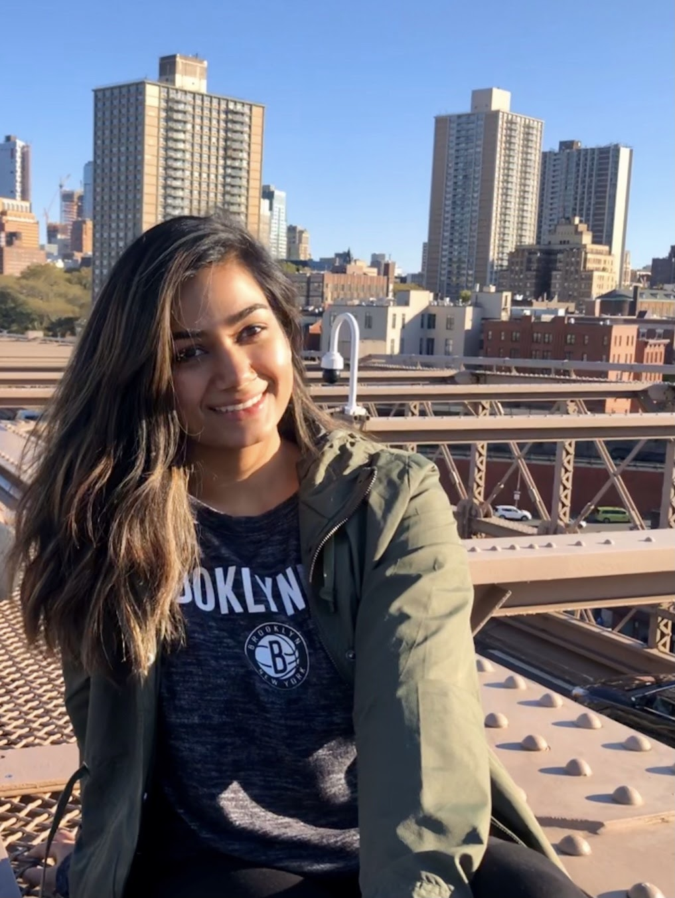
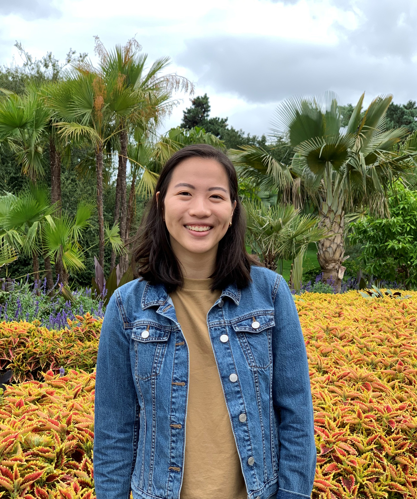

 

We are a team of MPH candidates studying epidemiology at Columbia University Mailman School of Public Health. 

 

#  Ayeshra Acharya

 

#  Zaynub Ibrahim
Hi! I am currently a second year MPH student at Columbia University, pursuing a degree in epidemiology with a concentration in global health. My undergraduate degree is in animal science, so I hope to combine these two areas of study and am interested in working with zoonotic disease in the future but also have a strong interest in maternal and reproductive health. Academics aside, my hobbies include rock climbing and bothering my pets (especially Sooji)!  

 

#  Cynthia Liu

  

#  Shelley Shen 

