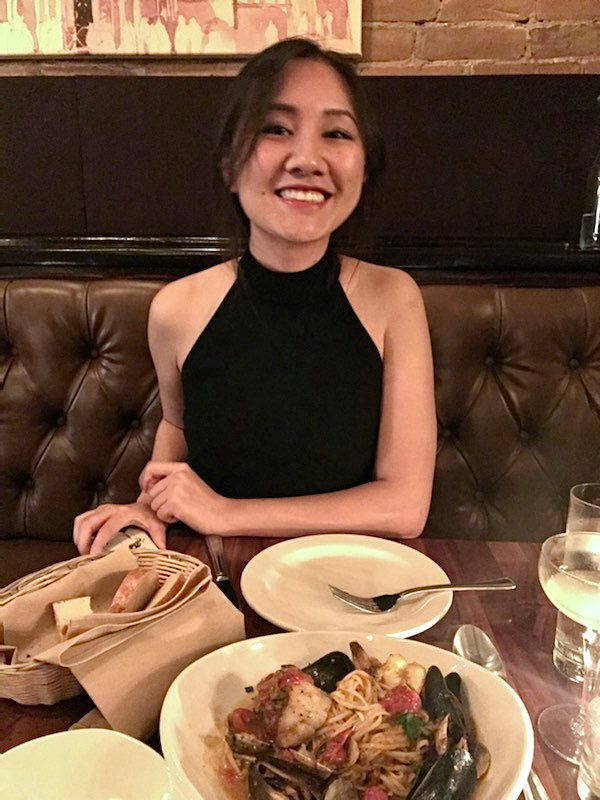

 

##### We are a team of MPH candidates studying epidemiology at Columbia University Mailman School of Public Health and taking Data Science I with Dr. Jeff Goldsmith.

 

#  
**Ayeshra Acharya**

Hi! I am a 2nd year MPH candidate in Epidemiology at Columbia University. Some of my interests within the field include maternal and reproductive health and disparities in breast cancer diagnosis and screening. During my free time, I enjoy exploring different parks in New York City and cooking! 

 

#  
**Zaynub Ibrahim**

Hi! I am currently a second year MPH student at Columbia University, pursuing a degree in epidemiology with a concentration in global health. My undergraduate degree is in animal science, so I hope to combine these two areas of study and am interested in working with zoonotic diseases in the future but also have a strong interest in maternal and reproductive health. Academics aside, my hobbies include rock climbing and bothering my pets (especially Sooji)! [Website]()

 

#  
**Cynthia Liu**
Text about Cynthia.

  

#  
**Shelley Shen** 

Hi, I'm Shelley and my degree focuses on epidemiology and health policy. My professional interests include the built environment, chronic disease, health disparities, and policy effectiveness. I hope to utilize data analysis and visualization to influence policies that can improve our physical and social environments and, subsequently, transform our health outcomes. Outside the classroom, I enjoy hiking, skiing, visiting art museums, and exploring new recipes. [Website]()

 

#  
**Sooji**

Hi, I'm Sooji! Just a little ouch mouse that enjoys sleeping all day and getting belly rubs. Sometimes I wake up for snacks (my favorites are egg yolks and blueberries!). My role in providing moral support for this project was extremely important and I take my job very seriously! [Instagram](https://www.instagram.com/sooji.the.hedgehog/)